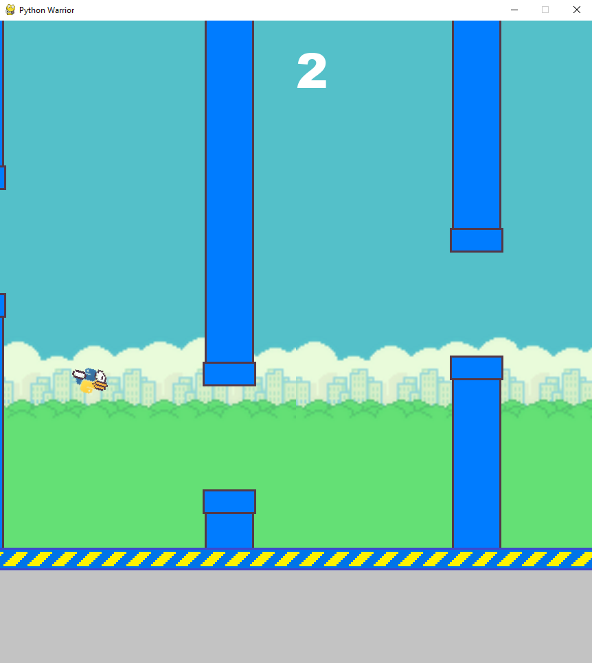

# Project_Pygame - "Python Warrior"
## Projekt zaliczeniowy z przedmiotu "Programowanie Obiektowe 2".
Projekt polegał na zaimplementowaniu gry napisanej w języku Python, wraz z wykorzystaniem biblioteki Pygame.
Gra "Python Warrior" składa się z trzech poziomów, przez które nawiguje nas menu:
  - level 1 - Poziom stworzony na podobieństwo gry "Flappy Bird", nasza postać zdobywa punkty omijając kolejno wygenerowane przeszkody.
  - level 2 - Poziom analogiczny do pierwszego, lecz z zwiększonym poziomem trudności: większa szybkość postaci oraz większa częstotliwość przeszkód.
  - level 3 - Poziom stworzony na podobieństwo gry "Space Invaders", sterowanie statkiem kosmicznym, który musi zestrzelić przeciwników (inne języki programowania), którzy atakują nasz statek.

- Menu:  
  

- Level 1,2:   
   

- Level 3:   
-    
